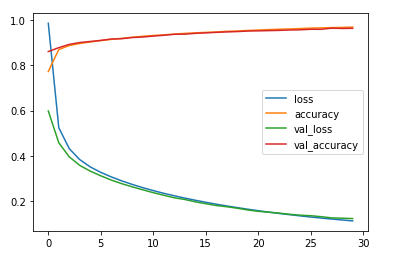
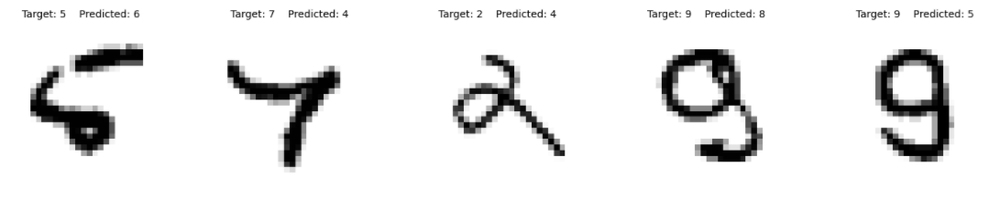
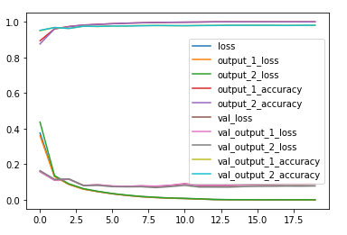

# Homework 2
This assignment once again uses the [MNIST Digit Set](https://www.tensorflow.org/datasets/catalog/mnist) to train a Neural Network to correctly identify
numbers out of a set of 70,000 images. A deep and wide architecture is used this time in order to train the model. The deep and wide network is created
using the [Keras Functional API](https://keras.io/guides/functional_api/). After being trained, the accuracy and loss of the model was analyzed and recoreded.

Some of the misclassified numbers included:

The model was then improved upon using the [Keras Subclassing API](https://keras.io/guides/making_new_layers_and_models_via_subclassing/) by continuously 
changing and tweaking values like amount of hidden layers, multiple outputs, input type, epochs, learning rate, neurons, and weights. After much 
experimentation, a final model with a superior accuracy and loss was achieved. 

## Resources
Homework 2 is made using a [Jupyter Notebbok](https://jupyter.org/) and makes use of the following tools:  
[Tensorflow](https://www.tensorflow.org/)  
[Numpy](https://numpy.org/)  
[Keras Functional API](https://keras.io/guides/functional_api/)  
[Sklearn](https://scikit-learn.org/stable/)
